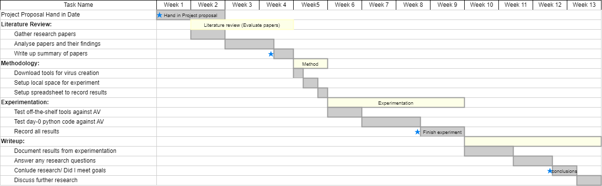

## Project Topic:

Within the cyber world, there is a constant battle between viruses and antivirus software. Due to computers evolving at an exponential rate, so are the techniques of virus development and mitigation. 
I want to understand the extent to which the stock antivirus system Windows Defender is able to prevent malicious executables from being run on a stock Windows machine. 
With this data, I will conclude how effective Windows Defender is when different forms of evasion are used.  

This research will focus on evaluating the effectiveness of different virus creation tools for Windows 10
I have chosen to focus on this operating system due to the market share in operating systems, with Windows holding a substantial percentage. 
"As of December 2020, over 76% of all computers worldwide were running some version of Windows" [@zaharia2024cyber].
Having such a large share in the market means that an attacker’s priority when trying to infect a machine is mainly aimed at a Windows machine; by evaluating the 
effectiveness of Windows Defender, we will be able to understand the possible future mitigations to be put in place so that all devices are protected from a multitude 
of potential viruses.

## Research Questions

  - **How well do off-the-shelf tools evade antivirus?**
  - **What are the key characteristics of a virus?**
  - **What behaviors cause Antivirus to flag a file as malicious?**
  - **What techniques, if any, can be used to evade Antivirus?**

## Overview of solution:

Several off-the-shelf tools are available for generating viruses and evading detection of AV systems.
To help AV developers understand the implications of these tools, they need to be able to evaluate the impact on AV detection rates.

The project will be based on experimentation; I will feed a Windows computer different versions of a virus or exploit and record two variables. Firstly, 
did the Antivirus pick up the virus and quarantine it? Secondly, if the virus runs as intended with full functionality. 

The results of experimentation will be used to create a report discussing the current state of the art in AV detection and evasion.

These viruses will be created using various readily available tools online and also by using original Python code I create. As different viruses will be given to the machine, I expect that most will be detected, but some will fly under the radar of the Antivirus. Hence, my results will be drawn as a percentage of viruses that were detected, and the ones that escaped detection 
will be discussed as to why they succeeded in not being detected. Additionally, specific evasion techniques may help avoid detection but, unfortunately, leave the virus broken due to being encoded or mangled too harshly.
After drawing these results, I’ll be able to suggest techniques that could be implemented to protect machines further, or if I’m unable to produce a virus that evaded Windows Defender, then I'll discuss the potential reasons why it was detected.

## Audience and Motivation:

As discussed in Section 1 above, as Windows holds a majority share in the market when it comes to computers, there are a range of tools that can be used to create effective viruses.
The impact of these tools regarding AV detection is continuously altering, and therefore, the environment is rapidly changing. With plenty of innovations from both attackers and defenders, it is not easy to produce long-lasting solutions.

Up-to-date sources indicate that "560,000 new pieces of malware are detected every day" [@jovanovic2023malware]. With this vast number of potentially 0-day viruses being created every day, there is no way that antivirus software can keep up and block all these threats before they infect multiple machines. 

[@jovanovic2023malware] Also says that "Every minute, four companies fall victim to ransomware attacks" This relates nicely to [@samarati2017cyber] report on how much cybercrime cost the UK in 2016, "Although ransomware ranked last in terms of the number of organisations affected (388,858), it ranked first in terms of financial losses (£7,356,060,699)". These statistics show us that more resources need to be dedicated to researching the techniques that attackers use to produce malware. After understanding why Antivirus is evaded, we will then be able to mitigate the impact of readily available tools and protect our computers. The reason so many organisations were affected is due to evasion techniques such as obfuscation and cryptography. Encoding and changing the structure of the payload will bypass specific detection techniques, such as signature-based scanning and potentially heuristic-based scanning, depending on the severity of the obfuscation. Also, techniques such as polymorphic code will allow code to be changed every time the program is run, further evading Antivirus by constantly changing its signature.

Antivirus software is arguably one of the most critical processes on our computers, blocking internal and external threats and protecting our computers from malicious 
users. My projects will be important to the blue and red teams within cybersecurity. With more excellent knowledge of how antivirus systems cope with different forms of 
evasion, will ensure that new protections are put in place to secure devices further. Also, I'm positive that my research will also benefit individual users who have little
knowledge of cyber threats. Reasoning for this is that demonstrating the different ways in which a virus can come will encourage users to be more cautious when
opening a file from an unsigned source. Furthermore, antivirus developers will be able to use my research to locate the flaws in any existing products. If a particular technique used guarantees antivirus evasion, then developers will be 
able to rectify any mistakes.

## Project Plan:

The project plan will follow an experimental methodology; I am using Getting Things Done (GTD) to plan my tasks[@allen2018getting]. This will involve recording outputs, processing the data, and then planning the next stage based on the outputs received.
This will allow me to plan time for the significant tasks but leave scope to add the details following the results of each piece of experimentation.

One potential problem I may face is the complexity of evading Windows Defender. Antivirus has had many years to develop and mitigate risks against new computer viruses. On the other hand, I will have, at best, a couple of months to develop several iterations of computer viruses to evade Windows Defender. Through my experimentation, I aim to demonstrate the robustness of Antivirus and that off-the-shelf tools are unlikely to work. This protects us from many individuals who may try to place a malicious executable on someone's machine.

As there is a coding aspect to my project, a lot of time will be spent learning new coding techniques in order to evade Antivirus. As there is a risk this will take too long, I am planning on leaving this task until the end. This way, I don't risk spending too much time on one aspect of the project, and it will allow me to focus on other areas.

